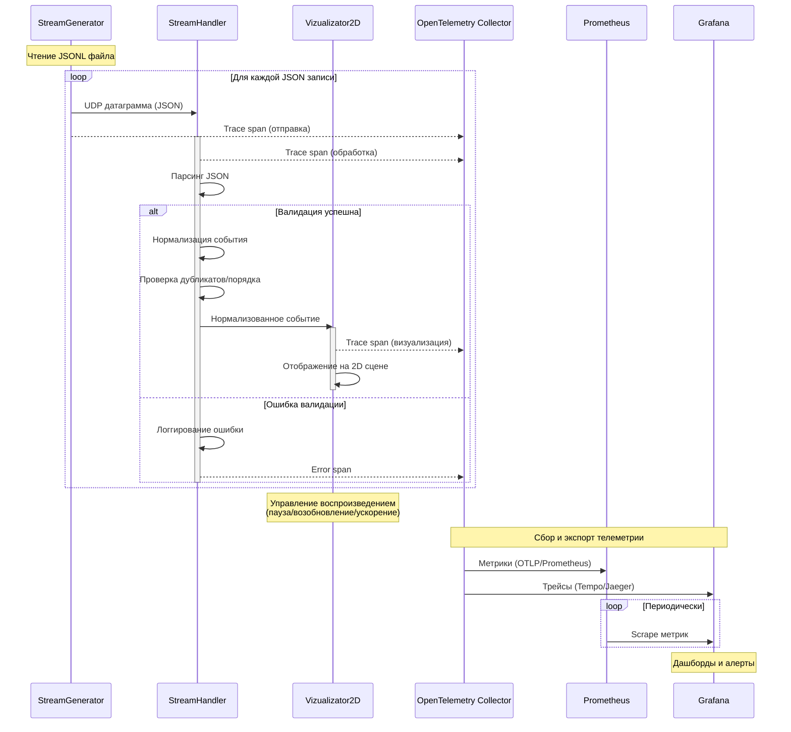

# rtls-stream-visualizer
Real Time Location System Stream Visualizer

# Архитектура приложения
## Описание компонентов
**stream_generator** -- CLI утилита, которая по заданным параметрам (IP, Port, скорость отправки сообщений, JSONL path) будет отправлять UDP датаграммы, состоящие из отдельных JSON, полученных из JSONL файла

**stream_handler** -- модуль приема и обработки UDP потока, который:
- Принимает UDP-пакеты
- Парсит и преобразовывает пакеты в нормализованные события
- Производит валидацию координат, корректности timestamp
- Обрабатывает дубликаты и out-of-order сообщения
- Маршрутизирует события в модуль визуализации
- Логгирует события, ошибки

**vizualizator_2d** -- модуль визуализации 2-х мерной сцены, который будет отображать все полученные события в соответствии с их timestamp, предоставляя возможность останавливать / возобновлять / ускорять воспроизведение

### Observability
**OpenTelemetry** -- инструментирование приложения для сбора трейсов и метрик со всех компонентов

**Prometheus** -- хранение и агрегация метрик (количество обработанных пакетов, ошибки валидации, latency и т.д.)

**Grafana** -- визуализация метрик и трейсов, дашборды для мониторинга состояния системы

## Схема взаимодействия

