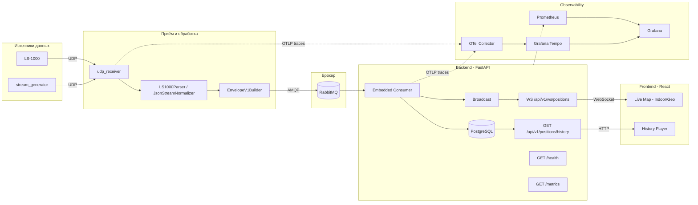

# RTLS Stream Visualizer

Система реального времени для приёма, обработки и визуализации данных позиционирования (Real-Time Location System).

## Архитектура


```mermaid
flowchart LR
    subgraph sources [Источники данных]
        LS1000[LS-1000]
        SG[stream_generator]
    end

    subgraph ingress [Приём и обработка]
        UDP[udp_receiver]
        Parser[LS1000Parser / JsonStreamNormalizer]
        Envelope[EnvelopeV1Builder]
    end

    subgraph broker [Брокер]
        RMQ[(RabbitMQ)]
    end

    subgraph backend_svc [Backend - FastAPI]
        Consumer[Embedded Consumer]
        DB[(PostgreSQL)]
        BC[Broadcast]
        WS_EP["WS /api/v1/ws/positions"]
        REST_EP["GET /api/v1/positions/history"]
        Health["GET /health"]
        Metrics["GET /metrics"]
    end

    subgraph frontend_svc [Frontend - React]
        LiveMap[Live Map - Indoor/Geo]
        History[History Player]
    end

    subgraph observability [Observability]
        OTelCol[OTel Collector]
        Tempo[Grafana Tempo]
        Prom[Prometheus]
        Grafana[Grafana]
    end

    LS1000 -->|UDP| UDP
    SG -->|UDP| UDP
    UDP --> Parser --> Envelope -->|AMQP| RMQ
    RMQ --> Consumer
    Consumer --> DB
    Consumer --> BC
    BC --> WS_EP
    DB --> REST_EP
    WS_EP -->|WebSocket| LiveMap
    REST_EP -->|HTTP| History

    UDP -.->|OTLP traces| OTelCol
    Consumer -.->|OTLP traces| OTelCol
    backend_svc -.->|/metrics| Prom
    OTelCol --> Tempo
    Prom --> Grafana
    Tempo --> Grafana
```

## Компоненты

| Компонент | Описание |
|-----------|----------|
| `stream_generator/` | CLI-утилита (Typer) — генерация тестового UDP-трафика из JSONL файлов |
| `stream_handler/` | Парсеры: `LS1000Parser` (протокол LS-1000), `JsonStreamNormalizer` (произвольный JSON → `NormalizedEvent`) |
| `core/` | Общие модули: конфиг, UDP клиент/сервер, RabbitMQ publisher, envelope, трейсинг, логирование |
| `udp_receiver/` | Точка входа для приёма UDP → парсинг → нормализация → envelope → RabbitMQ |
| `backend/` | FastAPI: встроенный RabbitMQ consumer, WebSocket real-time, REST history API, Prometheus метрики |
| `frontend/` | React SPA: indoor план (SVG + zoom/pan), geo-карта (Leaflet), live + history режимы |

## API

### REST

| Метод | Путь | Описание |
|-------|------|----------|
| `GET` | `/health` | Проверка доступности БД. `200 OK` / `503 Service Unavailable` |
| `GET` | `/api/v1/positions/history` | История траектории тега. Query: `tag_id` (обяз.), `from_ts`, `to_ts`, `limit`, `offset` |
| `GET` | `/metrics` | Prometheus-метрики |

### WebSocket

| Путь | Описание |
|------|----------|
| `WS /api/v1/ws/positions` | При подключении — JSON-массив всех текущих позиций (snapshot). Далее — поток envelope-объектов |

**Протокол WS:**
1. Клиент подключается → сервер отправляет `[{tag_id, x, y, ...}, ...]`
2. Каждое новое событие из consumer → `{schema_version, event_type, origin, payload: {...}}`
3. Клиент может отключиться в любой момент

## Observability

### Prometheus метрики

- `http_requests_total` — счётчик HTTP-запросов по method/endpoint/status
- `http_request_duration_seconds` — латентность HTTP
- `ws_active_connections` — активные WebSocket-соединения
- `consumer_messages_processed_total` — обработанные сообщения consumer
- `consumer_messages_failed_total` — ошибки (по reason: malformed_json, missing_tag_id, db_error)
- `db_write_duration_seconds` — латентность записи в БД
- `publisher_messages_total` — сообщения, отправленные в RabbitMQ
- `publisher_publish_duration_seconds` — латентность публикации

### OpenTelemetry Distributed Tracing

Трейсы проходят через всю цепочку обработки:

```
stream_generator → [UDP + traceparent в JSON] → udp_receiver → [AMQP headers] → backend consumer → DB + WS broadcast
```

- **stream_generator**: root span `generate_stream`, инжекция `traceparent` в каждый JSON-объект
- **udp_receiver**: извлечение `traceparent` из JSON, span `process_datagram`, инжекция в AMQP headers
- **backend**: извлечение из AMQP headers, spans `consume_message` → `db_write` + `broadcast`
- **FastAPI**: автоматическая инструментация HTTP/WS через `opentelemetry-instrumentation-fastapi`

Инфраструктура: OTel Collector → Grafana Tempo → Grafana (просмотр трейсов)

### Structured Logging

JSON-формат логов в production (`LOG_FORMAT=json`) с `trace_id` и `span_id` для корреляции с трейсами.

## Запуск

### Локальная разработка

```bash
# Backend
poetry install
poetry run yoyo apply --database "$DATABASE_DSN" migrations
poetry run python -m backend.main

# Frontend
cd frontend
npm install
npm run dev

# Stream generator (тестовый трафик)
poetry run python -m stream_generator.main \
  --source stream_generator/samples/test_data.jsonl \
  --ip 127.0.0.1 --port 9999 --batch-size 10

# UDP receiver
poetry run python -m udp_receiver.main
```

### Docker Compose (полный стек)

```bash
docker compose up --build
```

Сервисы:

| Сервис | Порт | Описание |
|--------|------|----------|
| `postgres` | `${POSTGRES_PORT}` | PostgreSQL 16 |
| `rabbitmq` | 5672, 15672 | RabbitMQ + Management UI |
| `backend` | `${API_PORT}` | FastAPI + embedded consumer |
| `frontend` | `${FRONTEND_PORT:-3000}` | React SPA (nginx) |
| `otel-collector` | 4317, 4318 | OpenTelemetry Collector |
| `tempo` | 3200 | Grafana Tempo (хранение трейсов) |
| `prometheus` | 9090 | Prometheus (сбор метрик) |
| `grafana` | `${GRAFANA_PORT:-3001}` | Grafana (дашборды + трейсы) |

Параметры берутся из `.env` в корне проекта.

### Тесты

```bash
# Backend (Python)
poetry run pytest -v

# Frontend (Vitest)
cd frontend && npm test
```

## База данных

- **`position_events`** — история всех событий (BIGSERIAL PK, индексы по `tag_id + ts_utc_ms DESC`)
- **`current_positions`** — последняя позиция каждого тега (PK `tag_id`, UPSERT с recency guard)

Миграции: `yoyo-migrations` в `migrations/`.

## Конфигурация

Основной файл: `config/settings.yaml`. Env-переменные для override:

| Переменная | Описание |
|------------|----------|
| `DATABASE_DSN` | PostgreSQL connection string |
| `RABBITMQ_URL` | AMQP URL |
| `API_HOST`, `API_PORT` | Host/port backend |
| `OTEL_EXPORTER_OTLP_ENDPOINT` | OTLP gRPC endpoint (default: console exporter) |
| `LOG_FORMAT` | `json` для structured logging |

## Зависимости

**Runtime:** FastAPI, psycopg, aio-pika, uvicorn, OpenTelemetry SDK, prometheus-client, python-json-logger, PyYAML, jsonschema, Typer, yoyo-migrations

**Dev:** black, pytest, pytest-asyncio, httpx

**Frontend:** React, react-leaflet, Tailwind CSS v4, Vite, Vitest

Python >= 3.12, Node.js >= 20
